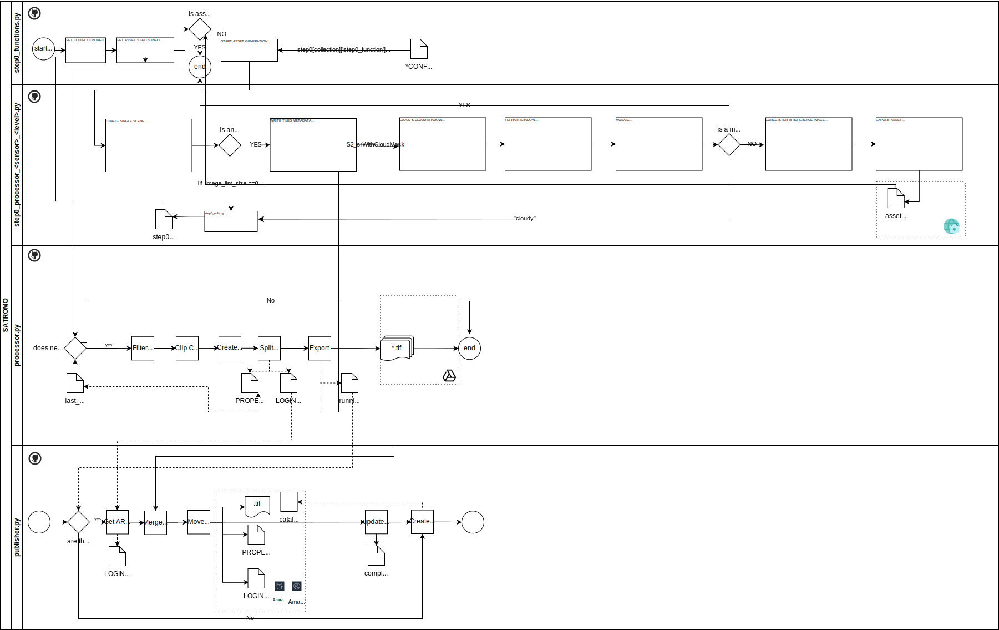

# SATROMO Processing chain

The "Erdbeobachtungs-SAtellitendaten fürs TRockenheitsMOnitoring" (SATROMO) consists of python code with ETL functionalities to operationally generate and provide AnalysisReadyData and indices from satellite sensors using GoogleEarthEngine, GithubAction and AWS S3. 

## Disclaimer

**Note: This project is currently in the proof of concept phase and is not intended for operational use.**

## Introduction and Project Description

This project aims to define automated spatial satellite products, indices, and analysis-ready datasets, as well as establish a geospatial data processing pipeline with traceable algorithms in the field of drought monitoring.
The aim is to have a serverless processing chain to derive and publish satrellite sensore derived products for drought monitoring. 
There are two enviroments
- DEV which is  a local machine with python installes
- PROD which is GitHub Action based .

## Installation

To install and set up the project, follow the instructions below:

1. Clone the repository to your local machine:
```
git clone https://github.com/swisstopo/topo-satromo.git
```
2. Install the project dependencies using pip:
```
pip install -r requirements.txt
```
3.Make sure you have Python 3.x and pip installed on your system.

[Optional] If you are using a virtual environment, activate it:
```
source <virtual-environment>/bin/activate
```
This step is recommended to isolate the project dependencies from your system-wide Python installation.

4. You are now ready to use the project!

For the use on your local machine / DEV 
- PROCESSOR: You need to create a folder "secrets" containing the GEE json according [Google Service Account](https://developers.google.com/earth-engine/guides/service_account) and a private key for the [service account](https://developers.google.com/earth-engine/guides/service_account#create-a-private-key-for-the-service-account)

For the use with GithubAction / PROD
You need in addition to run the processor as well:
- PUBLISHER: a rclone set up which transfers your data out of GDRIVE to you prefered location

## Solution architecture
### Program flows  (`satromo_processor.py` and `satromo_publisher.py`)



## Functionality in detail

For starters, we build a GithubAction & GEE python based ARD and Indicices extractor for Switzerland. The SATROMO operational module is started on a pre-defined schedule using [GitHub Actions](https://github.com/features/actions). During a "processor" run, the code:
1. triggers GEE extraction of products for the region of Switzerland using the configuration given in `configuration.py` and last update information in `tools/last_updates.csv`
2. stores ruining tasks in `processing/running_tasks.csv` and an appropriate accompanying text file for each product which is split in quadrants to enable GEE exports
3. persists information about status of running GEE processes IDs of the extracted data. These pieces of information are stored directly in the repository at hand.

A pre-defined time after the "processor" run, a "publisher" run starts. Assuming all exports are done. In it, the publisher process:
1. reads the persisted information as to the most recently bprocessed  products based on IDs in `processing/running_tasks.csv`
2. merges and clips the products, e.g. ARD, Indices etc locally in GitHubAction runner. be aware that the current limit is the disk space available on github ( it is approx 7 GB)
3. moves the product and its persisted information with rclone to S3. 
4. updates `tools/last_updates.csv`

## Technologies

- Python, GEE, GDAL, RCLONE
- GitHub Actions at pre-defined times (essentially CRON jobs): GitHub Actions are free when effected from an open repository.
- GitHub Secrets for GEE, S3 credentials
- `gee` and `requests` (or similar) Python packages

## Roadmap

- [ ] Add Changelog
- [ ] Implement STAC Cataloge description  
- [ ] Implement Co-Registration correction
- [ ] Implement Topografic shadow information
- [ ] Products
    - [ ] R1 Rohdaten Level-2A 
    - [ ] N1 Vitalität – NDVI Anomalien
    - [ ] M1 Vitalität – NDMI Anomalien
    - [ ] N2 Veränderung – NDVI Anomalien
    - [ ] B2 Natürliche Störungen – NBR
    - [ ] V1 Vegetation Health Index

## Contributing

Contributions are what make the open source community such an amazing place to learn, inspire, and create. Any contributions you make are **greatly appreciated**.

If you have a suggestion that would make this better, please fork the repo and create a pull request. You can also simply open an issue with the tag "enhancement".
Don't forget to give the project a star! Thanks again!

1. Fork the Project
2. Create your Feature Branch (`git checkout -b feature/AmazingFeature`)
3. Commit your Changes (`git commit -m 'Add some AmazingFeature'`)
4. Push to the Branch (`git push origin feature/AmazingFeature`)
5. Open a Pull Request

## License

Distributed under the BSD-3-Clause License. See `LICENSE.txt` for more information.

## Credits and Acknowledgments

* [Google Earth Engine API](https://github.com/google/earthengine-api)
* [GDAL](https://github.com/OSGeo/gdal)
* [RCLONE](https://github.com/rclone/rclone)


## Contact Information

David Oesch - david.oesch@swisstopo.ch
Joan Sturm - joan.sturm@swisstopo.ch

Project Link: [https://github.com/swisstopo/satromo](https://github.com/swisstopo/satromo)


